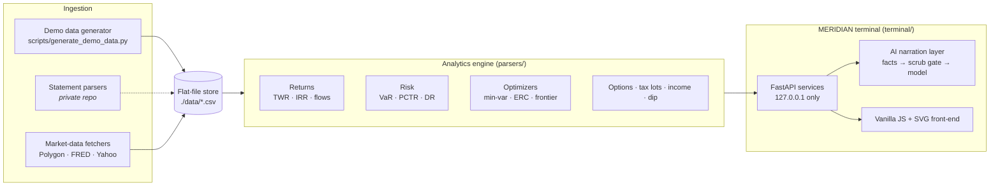

# Architecture

MERIDIAN is a local-first portfolio analytics terminal: a Python analytics
engine over a flat-file data store, a FastAPI service layer bound to loopback,
and a dependency-free vanilla-JS front-end that renders everything the services
compute. No cloud, no telemetry, no database server — the whole system is a
directory of CSVs and one process.

## The data store is the contract

Every artifact the system computes from is a small, inspectable CSV in one
directory (`APP_DATA_DIR`, default `./data`): positions per statement month,
the transaction ledger, per-account monthly NAV/flow rows, IRR summaries,
daily prices, benchmark total-return series, factor series, the tax-lot
ledger, and option snapshots. Services never reach around the store — the
`load_frames` seam reads it into one immutable bundle per request, and every
filter (broker, account, asset class, history start) narrows that bundle at a
single choke point so a scoped view can never leak whole-book numbers.

In this repository the store is populated by `scripts/generate_demo_data.py`,
which fabricates a fictional book from a fixed seed and then derives every
downstream artifact the same way the app would (IRR through the engine's own
solver, summaries reconciling to positions to the cent). In the private
deployment the same store is fed by PDF statement parsers for two real
brokerages — those parsers encode broker-specific statement vocabularies and
stay private; their absence changes nothing about the runtime, which only
ever sees the store.

## Engine layer

Pure computation, no I/O beyond the store, unit-tested in isolation:

- **Returns.** Statement-anchored monthly time-weighted returns with explicit
  external-flow handling (internal transfers are paired and excluded via a
  `flow_scope` column), linked and annualized; money-weighted IRR via a
  bisection `xirr` with a corruption tripwire — an IRR pinned at the solver's
  floor is treated as a data-integrity signature, not a result. Value and
  return run on two clocks: market value rolls forward to today while the
  return series ends at the last real statement, with the gap shown as an
  explicitly provisional stub.
- **Risk.** Rolling vol/beta, historical and parametric VaR/CVaR, per-position
  percentage contribution to risk under EWMA and Ledoit–Wolf covariance
  estimators, diversification-ratio regime classification, drawdown episodes,
  and stress scenarios with NaN-safe crash-beta exclusion.
- **Optimizers.** Minimum-variance and equal-risk-contribution with per-name
  and per-class caps (active-set pinning: solve, pin violators, re-solve),
  risk budgets, and a traditional efficient frontier — plus what-if candidate
  tickers that flow through every optimizer.
- **Options.** Black–Scholes pricing and greeks, protective-put hedge-basket
  construction with beta-weighted sizing and honest NaN handling for
  no-history names, IV histories and rank.
- **Tax.** A FIFO lot engine replaying the ledger with wash-sale windows,
  term ripening, amortization-aware reconciliation bands, a harvest scanner,
  and a sell-simulator feeding a bracket-aware tax estimate.
- **Dip analytics.** Drawdown-depth statistics with an EVT/GPD tail model and
  a walk-forward referee: proposed dip signals are validated out-of-sample
  and their verdicts — including the honest negatives — are registered in
  committed JSON.

## The terminal

The front-end is deliberately dependency-free: hand-built SVG primitives with
shared axis/crosshair/tooltip helpers, no chart library, no CDN, strict
same-origin. All numbers are computed service-side and shipped as JSON — the
JS layer formats and draws, it never re-implements math. The server binds
`127.0.0.1` only and rejects non-loopback `Host` or cross-site `Origin`
headers before any route runs, which closes DNS-rebinding and CSRF against a
local instance. Long-running data refreshes run as single-flight background
jobs with a polled status contract.

## AI narration layer

Each tab has an optional AI box, and an AI Analysis tab aggregates the story.
The model never sees raw data: per-section reducers distill the store into a
compact facts payload; a scrub gate then refuses any payload containing
account-mask-shaped strings before it leaves the process. Responses are
generated asynchronously and cached against a signature of the data files, so
repeated views are free. This repository ships a pre-generated cache for the
demo dataset — the demo runs fully offline; a live `ANTHROPIC_API_KEY`
re-enables on-demand narration.

## Testing and guardrails

- ~3,600 unit, contract, route, and golden tests run on every push (CI is a
  cold `pip install` of exactly pinned dependencies on Linux).
- Golden snapshots pin every service payload against the committed synthetic
  fixture; float comparisons are tolerance-aware where linear algebra is not
  bit-reproducible across BLAS builds, while structure and formatted strings
  stay exact.
- The demo generator self-checks its own output (leak scan, engine sanity,
  chart plausibility) and is locked deterministic by a byte-identity test.
- Layered tripwires: a pre-commit secrets scan, a pre-commit
  institution-name block, the AI scrub gate at runtime, and the IRR
  corruption floor in the engine.

## Provenance

This repository is assembled from a private codebase that runs daily against
a real multi-broker portfolio. Everything here is the real architecture and
the real engine code; the broker-statement parsers and all personal data are
withheld, and the demo dataset — brokers, tickers, and every number — is
synthetic by construction.
