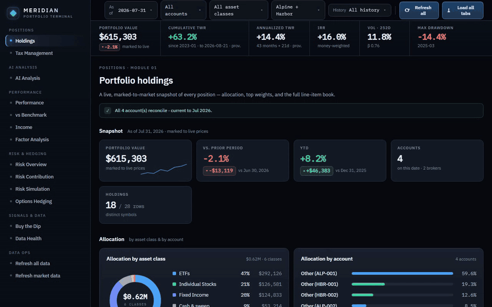
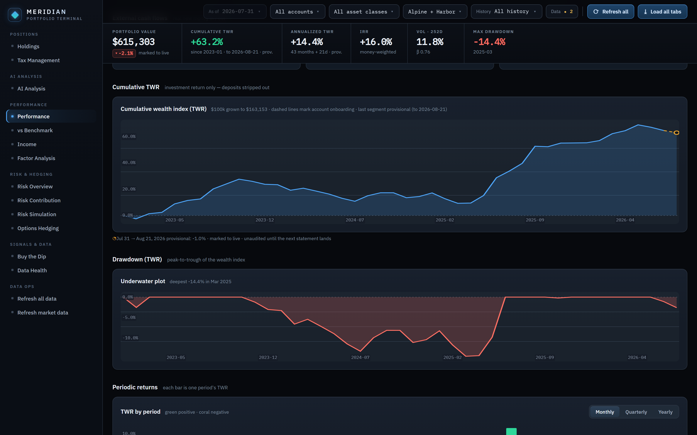
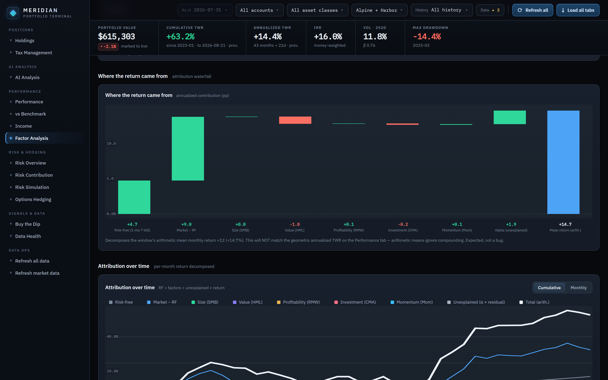
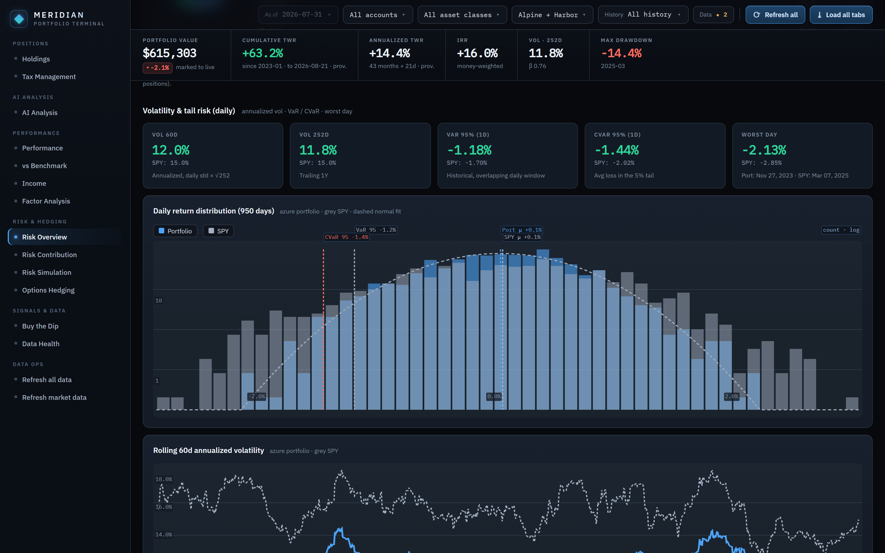
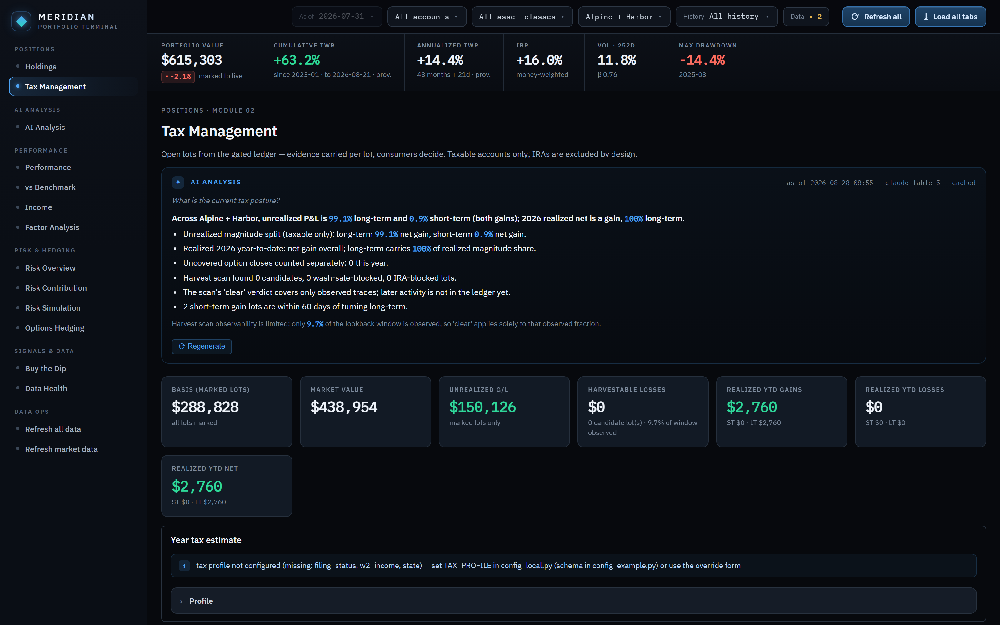
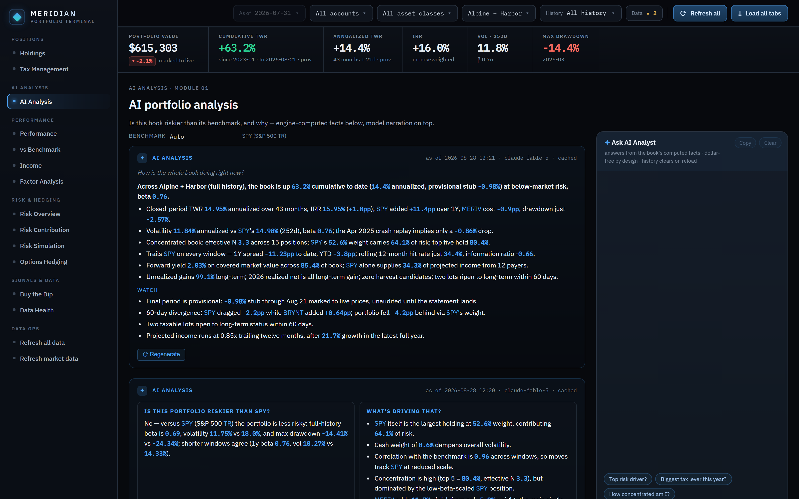
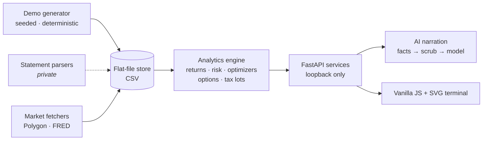

# MERIDIAN — Portfolio Analytics Terminal

**Institutional-grade portfolio analytics for an individual investor — performance
attribution, risk, income, options, and tax intelligence in one local-first
terminal.**

> **Demo data is synthetic.** Every broker, ticker, account, and number in this
> repository and its screenshots is fictional, generated by a seeded script.
> Nothing here describes a real portfolio.



## Why this exists

Brokerage websites tell you what you own; almost none of them tell you the
truth about how you're doing. Multi-account, multi-broker investors get no
honest time-weighted return, no view of where risk actually concentrates, no
tax-lot intelligence, and no way to ask "compared to what?" — so I built the
system I wanted: statement-anchored returns computed the way an institution
would compute them, risk decomposition that names the positions responsible,
and a tax engine that knows every lot. It runs entirely on my machine, on my
data, with an AI analyst wired into every screen — and this repository is that
system, rebuilt for publication around a fully synthetic book.

## What it answers

**Performance — "how am I actually doing?"**
- Time-weighted vs money-weighted return, separated and reconciled, with
  external flows paired off so transfers never masquerade as gains.
- Against what? A switchable yardstick — S&P 500 total return, or a 60/40
  blend that selects itself when the scoped book is majority fixed income.

**Risk — "what hurts, and how much?"**
- Per-position contribution to portfolio risk under multiple covariance
  estimators; VaR/CVaR; drawdown episodes; correlation regime tracking.
- What-if simulation and constrained optimizers (min-variance, risk parity,
  efficient frontier) with per-name and per-class caps.



**Income & factors — "what does this book pay, and what drives it?"**
- Forward income projection, yield-on-cost, dividend calendars.
- Fama-French factor regressions with rolling betas and honest significance.



**Options & tail events — "what if it breaks?"**
- Protective-put hedge construction with beta-weighted sizing and cost curves.
- Drawdown statistics with an EVT tail model — and a walk-forward referee
  that validates every proposed "buy the dip" signal out of sample, with the
  failed ideas registered right next to the one that survived.



**Tax — "what would selling actually cost?"**
- A FIFO lot ledger replayed from the transaction history: wash-sale windows,
  short/long term ripening, harvest candidates, and a sell-simulator that
  prices the tax bill before you trade.



**An AI analyst on every screen**
- Each module carries a model-written read of its own numbers, and an AI
  Analysis tab narrates the whole book — computed facts in, prose out, with a
  scrub gate that refuses any payload shaped like an account identifier. The
  demo ships a pre-generated cache, so all of it works offline.



## Architecture



The store is the contract: every artifact is an inspectable CSV, services read
it through one seam, and every filter narrows at a single choke point. The
full write-up is in [ARCHITECTURE.md](ARCHITECTURE.md).

## Design decisions

- **Two clocks, both shown.** Market value rolls forward to today; the return
  series ends at the last audited statement, with the gap labeled provisional.
  Blending them is how dashboards quietly lie.
- **Time-weighted as the headline, money-weighted beside it.** TWR judges the
  strategy; IRR judges the investor's timing. They answer different questions,
  so both are first-class and the engine treats an IRR pinned at the solver's
  floor as a data-corruption signal, not a result.
- **No chart library.** The front-end draws every chart with hand-built SVG
  primitives behind a strict no-external-asset policy — the page makes zero
  third-party requests, ever.
- **Loopback is the security boundary.** The server binds 127.0.0.1 and
  rejects foreign `Host`/`Origin` headers outright; there is no auth because
  there is no exposure.
- **Negative results are kept.** Signal ideas run through a walk-forward
  referee, and the verdicts committed to the repo include the four ideas that
  failed. An analytics tool you can trust has to be allowed to say no.

## Stack

| Layer | Choice |
|---|---|
| Engine | Python · pandas · NumPy · SciPy |
| Service | FastAPI · uvicorn (loopback only) |
| Front-end | Vanilla JS · hand-built SVG · IBM Plex |
| AI | Claude (Anthropic API) · offline demo cache |
| Data | Flat CSV store · Polygon/FRED fetchers |
| Tests | ~3,600 unit/contract/golden tests · CI on every push |

## Quickstart

```bash
git clone https://github.com/grohotun-main/meridian-portfolio-terminal.git
cd meridian-portfolio-terminal
python -m venv .venv && .venv\Scripts\activate    # or: source .venv/bin/activate
pip install -r requirements.txt
copy config_example.py config_local.py            # or: cp
python scripts/generate_demo_data.py
python -m terminal
```

Opens at `http://127.0.0.1:8502`. The demo path is fully offline — no API
keys, no network. A [Polygon](https://polygon.io) key enables live price
refreshes and an [Anthropic](https://console.anthropic.com) key enables live
AI narration; see [.env.example](.env.example).

**Demo data reminder:** the generated book — brokers "Alpine" and "Harbor",
every ticker, every dollar — is synthetic, produced by
[`scripts/generate_demo_data.py`](scripts/generate_demo_data.py) from a fixed
seed, and self-checked for plausibility before the script will even finish.

## How this was built

The system was designed and built by one person with AI-assisted development
(Anthropic's Claude Code) over several months and a few hundred reviewed pull
requests in the private repository it was extracted from; every merge passed
a ~3,600-test suite, golden-snapshot gates, and live verification against the
real deployment.

## About

Built by [@grohotun-main](https://github.com/grohotun-main). The production
instance runs daily against a real multi-broker portfolio; the statement
parsers and all personal data stay private.
